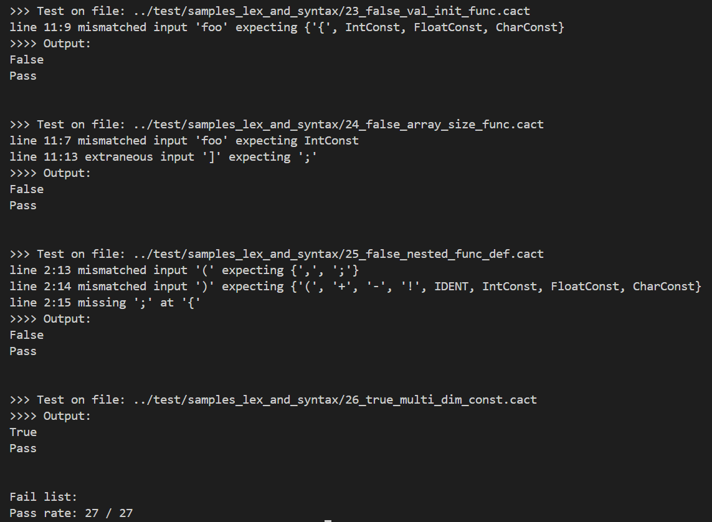

# 编译原理研讨课实验PR001实验报告

## 任务说明

- 熟悉antlr的安装过程和使用；
- 根据给出的CACT文法规范，编写.g4文件，并通过Antlr生成CACT源码的词法-语法分析;
- 覆写Antlr中默认的文法错误处理机制，能检查出源码中的词法语法错误;
- 实现一个简单的编译器前端可以处理输入的cact源码;

## 成员组成

第三组
成员：杜璁 俞博涵 周波

## 实验设计

### 设计思路

1. 根据提供CACT语言规范，并结合ANTLR代码的语法规则编写CACT.g4文件，通过antlr编译样例结果进行修正；
2. main函数先对输入流字符构建语法分析树，采用listener模式遍历语法树。将构建的监听器和语法分析树传入ANTLR提供的遍历器对象中的walk方法，进行自动遍历和检测。

### 实验实现

1. 设计编译器的目录结构

    ```
    cc/
    ├── build/           # 编译后的输出文件
    ├── deps/            # ANTLR工具安装
    ├── grammar/         # 文法文件、语法分析器和词法分析器
    ├── src/             # 编译器主体代码
    └── test/            # 测试样例
    ```

2. 根据CACT语言规范编写.g4文件<br><br>
    Parser部分主要按照CACT语言规范中给出的产生式，翻译使其符合ANTLR语法规则。例如语言规范文件中的[]，{}分别表示匹配0或1次、重复任意次，按照ANTLR文件编写规则应该对应的改为()?、()*。
    
    同时也对部分产生式进行了语法优化。例如显式消除了左递归：

    ```antlr4
    //CompUnit → [ CompUnit ] ( Decl | FuncDef )

    compUnit
        : (decl | funcDef)+
        ;
    ```
    上面的产生式相当于重复一次或多次Decl或FuncDef。于是添加()+代表文法中的重复出现一次及以上。

    表达式部分也是同理，这里以``addExp``为例，其余表达式逻辑类似：

    ```antlr4
    //AddExp → MulExp | AddExp ('+'|'-') MulExp

    addExp
        : mulExp (addOp mulExp)*
        ;
    ```

    Lexer部分同样根据CACT指令书里的设计,同时需要完善部分具体的词法定义。

    主要考虑数值常量的词法规则，数常量分为整型常量、字符常量和单精度浮点常量：

    ```antlr4
    number
        : IntConst 
        | CharConst 
        | FloatConst
        ;
    ```

    对于整型常量``IntConst``，分十进制、八进制、十六进制三种情况考虑。:

    ```antlr4
    IntConst
        : DecimalConst 
        // 十进制：除了“0”之外，十进制整数的首位数字不为0。
        | OctalConst 
        // 八进制：以整数0开头，后由0-7的数字组成，如：000、0127
        | HexadecConst 
        //十六进制：以0x或0X开头，后由0-9、a-f、A-F中的数字组成。
        ;

    fragment DecimalConst
        : NonZeroDigit Digit*
        ;

    fragment OctalConst
        : '0' OctalDigit*
        ;

    fragment HexadecConst
        : HexadecPrefix HexadecDigit+
        ;

    fragment NonZeroDigit
        : [1-9]
        ;

    fragment Digit
        : [0-9]
        ;

    fragment OctalDigit
        : [0-7]
        ;

    fragment HexadecPrefix
        : '0x'
        | '0X'
        ;

    fragment HexadecDigit
        : [0-9a-fA-F]
        ;
    ```

    字符常量``CharConst``的设计比较简单，由单引号包围。起初由于讲义前后描述不一致，在怎么支持转义符上有一些疑惑，询问助教后得知不需要支持，最后版本如下：

    ```antlr4
    CharConst
        : '\'' Character '\''
        ;

    fragment Character
        : ~['\r\n]
        ;
    ```

    单精度浮点常量``FloatConst``的设计照搬了[ISO/IEC 9899](https://www.open-std.org/jtc1/sc22/wg14/www/docs/n1124.pdf)中第57页关于浮点常量的定义进行设计，只保留了其中十进制浮点数的部分：

    ```antlr4
    FloatConst
        : FractionalConst Exponent? FloatSuffix?
        | DigitSeq Exponent FloatSuffix?
        ;

    fragment FractionalConst
        : DigitSeq? '.' DigitSeq
        | DigitSeq '.'
        ;

    fragment Exponent
        : [eE] Sign? DigitSeq
        ; 

    fragment Sign
        : [+-]
        ;
        
    fragment FloatSuffix
        : [fF]
        ;
    ```

3. 表达式优先级在设计上的体现<br><br>
   CACT规范中很重要的一部分是优先级，例如要要求语法完成1+2*3中先运行乘法。这就需要定好表达式间的优先级，按照语法规则参考文件中的建议顺序：

   ```
   Cond
    └── LOrExp
           └── LAndExp
                   └── EqExp         
                         └── RelExp         Exp
                                └── AddExp ──┘
                                       └── MulExp
                                              └── UnaryExp
                                                       └── PrimaryExp
   ```

   这个结构严格遵循了优先级从低到高的规定，在代码编写过程中从优先级低的算符到优先级高的算符的顺序构造文法规则，具体代码见代码108-167行。

   还需要考虑表达式内部的优先级，比如"<"和"<="应该优先匹配"<="：

   ```antlr4
   relExp
        : addExp (relOp addExp)*
        ;

   relOp
        : '<='
        | '=>'
        | '<'
        | '>'
        ;
   ```

4. 词法和语法错误处理<br><br>
    使用antlr的listener模式自动生成了相应的cpp文件后，参考``CACTListener``的实现方式，发现``CACTListener``继承自``ParseTreeListener``查看``ParseTreeListener.h``文件获悉这个类只有四个方法。

    ```cpp
    class Analysis : public antlr4::tree::ParseTreeListener {
        public:
            virtual void enterEveryRule(ParserRuleContext* ctx) override {}
            virtual void visitTerminal(tree::TerminalNode* node) override {}
            virtual void visitErrorNode(tree::ErrorNode* node) override 
            {
                std::cout << "False" << std::endl;
                exit(1);
            }
            virtual void exitEveryRule(ParserRuleContext* ctx) override {}
    };
    ```

    我们从``ParseTreeListener``继承``Analysis``，重写``visitErrorNode``方法，这样在进入语法树错误节点的时候就会打印出错并返回1退出。<br><br>

5. 调试过程中遇见的错误汇总<br><br>
   最开始完成.g4文件编写后编译文件，通过脚本自动化运行所有测试样例。

   ```
   // 路径build/test.sh

    # 首次使用前
    chmod +x ./test.sh

    # 批量测试
    ./test.sh
   ```
   报错文件编号和错误点如下：

   ```
   07:匹配到部分代码后仍有剩余但成功
   14:调用函数j=get_int();认为_int后需要有";"
   19:，函数内int c=b(应该先声明c是int类型再赋值c=b?)
   20:int a=2x3(同上)
   23:int c=foo(a)，同上
   26:浮点数定义出错，对的判定成错的
   ```

    根据错误信息回看.g4文件，发现是因为常量表示式错误和Ident定义中没有添加下划线_。

    ```antlr4
    //旧代码
    constExp 
        : addExp  //使用的IDENT必须是常量
        ;
    
    //新代码
    constExp 
        : number  //使用的IDENT必须是常量
        ;

    IDENT
        : [a-zA-Z_][a-zA-Z0-9_]* // 旧代码中缺少最后一个“_”
        ;
    ```

    修改完成后除07报错均正确。
    对07号文件报错最终选择在main.cpp文件中进行额外的报错要求设计：

    ```cpp
    if (tokens.LA(1) != antlr4::Token::EOF) {
        std::cerr << "Error: extra input after valid program" << std::endl;
        std::cerr << "Remaining token: " << tokens.LT(1)->getText() << std::endl;
        return 1;  
    }
    ```

    通过检查是否有剩余的未匹配token来识别赋值语句是否不在函数内部。<br><br>

## 总结

### 实验结果总结

运行结果如下图所示，由于测试样例较多，仅截取了末尾4个测试样例以及总结部分。可以看到27个样例均通过。



通过这次实验我们学会了antlr的使用，熟悉了CACT文法的语法规范和作用，完成了一个符合CACT语法和词法规范的简单的编译器前端，并且根据报错完成了对.g4文件的完善。

### 分成员总结

杜璁：经过本次实验了解了CACT文法的基本内容，尝试使用了ANTLR4工具。在实验过程中我参与了g4文件的编写，完成了debug过程，对g4文件的编写以及antlr4工具有了基本的了解。

俞博涵：本次实验学习了ANTLR4工具的用法，参与了g4和源代码的编写，实现了自动化测试脚本并对实验报告进行了修订。在编写和测试的过程中，对文法规范和antlr4工具有了一个基本的认知。

周波：通过这次实验我通过阅读了解到了CACT文法的基本内容。通过查阅资料也了解到了ANTLR文法的基本内容以及接触到了visitor和listener模式的区别，最后也使用listener模式完成了实验内容。
